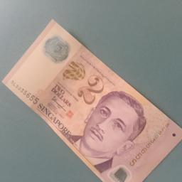
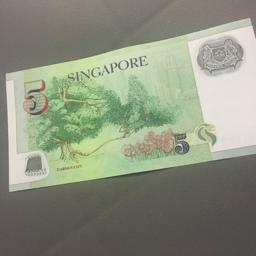
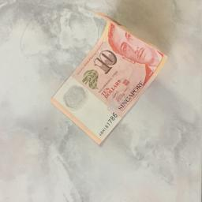
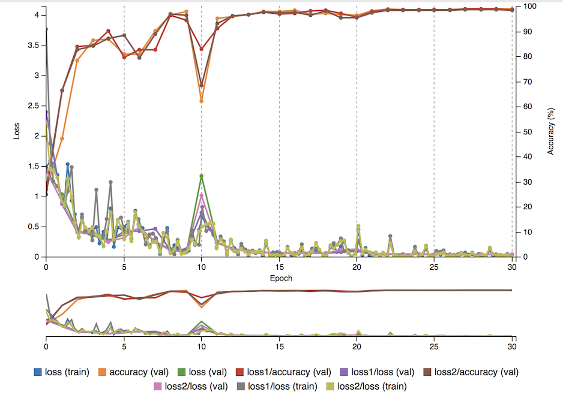
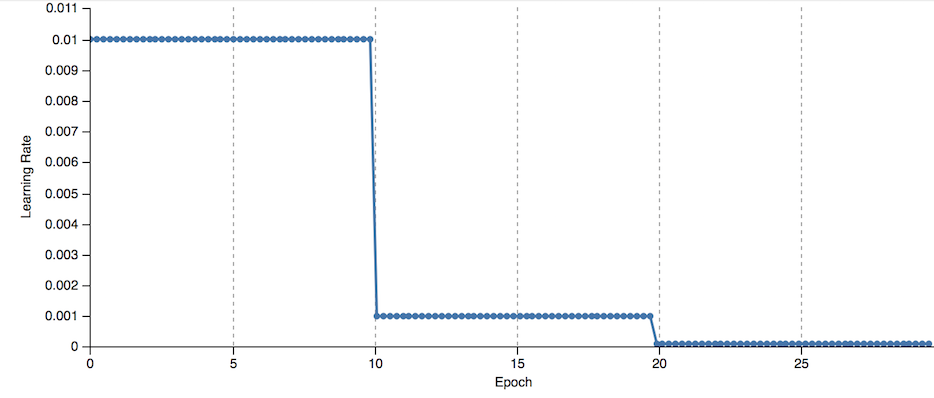
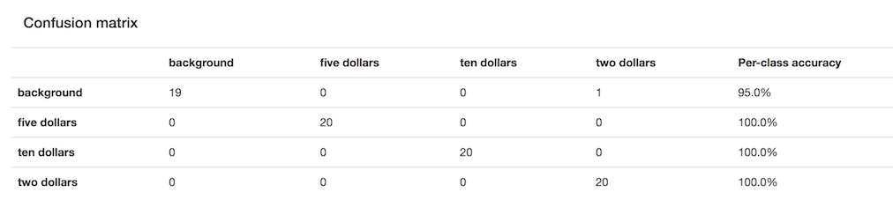
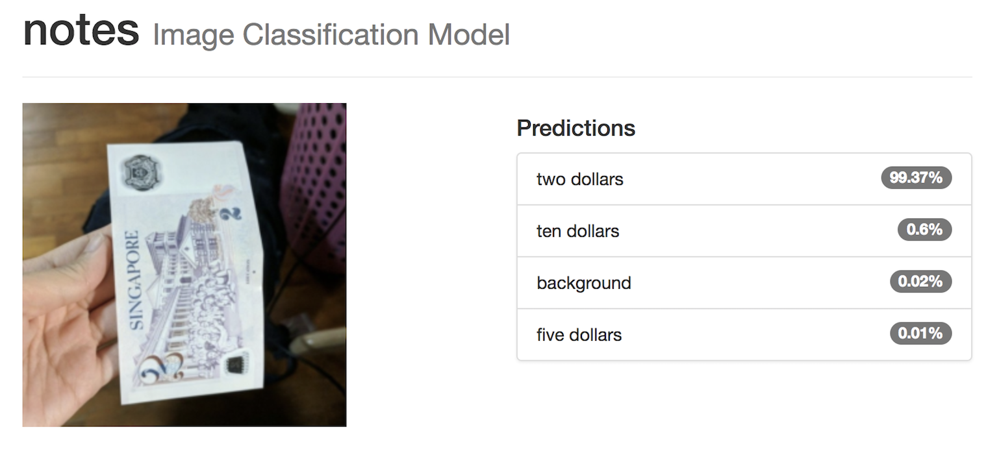
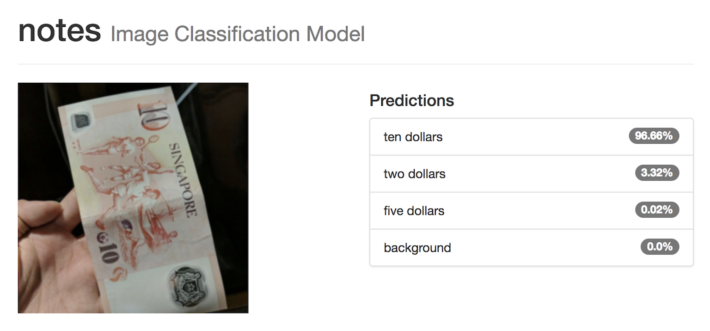

# SG Notes Classification
The objective of this project is to prototype a simple vision inference system to help the visually impaired recognize different cash denominations in Singapore.

## Intro
Paying for items using cash is a task that is simple and familiar to many. Yet, this simple act of paying has been a constant struggle for the visually impaired. Without a good sense of sight, the visually impaired risk being cheated and often have to rely on the honesty of the cashier. Often, many of them have to resort to applying different strategies to recognize cash notes, such as feeling for a unique texture and to estimate the size of the note by folding. However, with countries often redesigning their currency, many of these strategies tend to fall short.  
This project aims to create a deep learning model that can be used to recognize different cash denominations from images, and integrated to a mobile application for use.  

## Method
The NVIDIA Digits environment was used for training, validation and testing of the convolutional neural network. 

GoogLeNet model was chosen for its effectiveness in image classification. GoogLeNet network was used with Stochastic Gradient Descent with 30 epochs and a starting learning rate of 0.01. A separate test dataset of 20 images for each class was used for testing the model’s accuracy. The speed of each individual classification run was also evaluated. 

## Data
Classes used: 
- $2 note
- $5 note 
- $10 note 
- background (no note)

### Sample Images
$2            |  $5 | $10 | Background
:-------------:|:-----------:| :-------------:|:-----------:
 |  |   |  

Using different backgrounds, lighting and angles, 100 photos of each cash denominations were being captured and then resized to 256 x 256 for training with GoogLeNet. To increase the training size and to improve the accuracy of the model, the dataset was augmented by rotating the images by 90, 180 and 270 degrees. This resulted in 400 images for each class. 

Three different datasets for training, testing and validation were then created. For each class, there were 280 images used for training (70%), 100 images used for validation (25%) and 20 images used for testing (5%). 

## Results
It can be observed that the training loss decreased significantly after 10 epochs. The learning rate also decreased from the 10 epochs. The trained model was able to achieve an accuracy of more than **98% correct classification** of all the classes after 30 epochs. The inference time averages around 5ms.

Performance  |  Learning Rate 
:-------------:|:-----------:
  |  

Sample Prediction 1  |  Sample Prediction 2 
:-------------:|:-----------:
  |  

## Discussion
The high accuracy of the model could be due to data quality (zoomed in shots of the notes and less noise) and the simple shape and colors of the notes. Considering the use case stipulated in the introduction, this is likely sufficient as the user will most likely hold up a note to the camera of a phone, or place the money on a table and capture the image in close range. 
### Next Steps
- the images can be augmented further to account for more settings and light intensity
- coin denominations can be also be classified to extend use case
- image segmentation to allow user to recognize multiple cash denominations at one go
